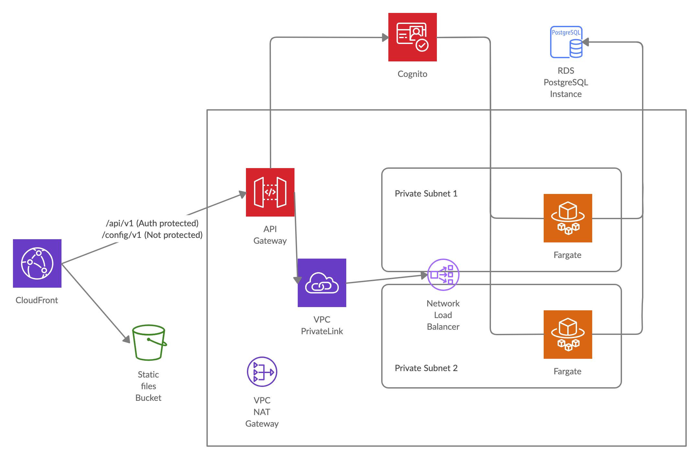

# Mira Sample Apps

The Mira Accelerator includes the following sample applications. Follow the `README.md` file provided in each sample app for full instructions.

## S3 Webhosting Sample
- [mira-sample-s3-webhosting](https://github.com/nearform/mira-sample-s3-webhosting/generate)

This application is a simple hello world app. This sample app is recommended for project owners who want the benefits of Mira CI orchestration only.

The infra/src/index.ts file contains the the full application infrastructure definition.

## Titus App

- [Titus](https://github.com/nearform/titus)

Titus is a development and deployment stack for SaaS applications that encapsulates best practice and supports rapid innovation.

Using Titus across the organisation drives consistency while accelerating project set-up and deployment. Even unskilled cloud developers can rapidly get from project kick-off to feature development without understanding all of the underlying cloud services.

Titus provides an excellent developer experience for projects and allows rapid onboarding of new developers.

### Overview
This sample application uses many AWS services and can be used as a reference to create a complex infrastructure using Mira.

At a high level, Titus is composed of:

- React frontend
- API service
- Authentication with Cognito
- Data storage on RDS Postgres

The schema below shows the deployed architecture:

The web stack contains a React.js [Single Page Application](https://en.wikipedia.org/wiki/Single-page_application) which provides the UI.

The application has a single entry point through CloudFront that manages the routing, serving static files from an S3 Bucket and the API calls from the API Gateway.

The API service runs an ECS Fargate container service, with a Network Load Balancer (NLB) and Autoscaling.

The RDS Postgres instance provides the RDBMS features to the application.

The Authentication is managed by API Gateway through a Cognito UserPool. 

The API Gateway is connected to NLB using a VPC Private Link. 
The NLB and Fargate instances are not accessible from the public network; they can be accessed only by the API Gateway.

A DNS entry is created in Route53 and a certificate is assigned to the endpoint to allow connection through https.

For full instructions, follow the [README.md](https://github.com/nearform/titus/tree/master/packages/titus-infra-aws) file provided in the Titus app.

<!-- - [Cognito 3-Tier Web App](#cognito-3-tier-web-app)-->
<!-- - [Auth0 3-Tier Web App](#auth0-3-tier-web-app)-->
<!-- - [Personalize App](#personalize-app)-->

